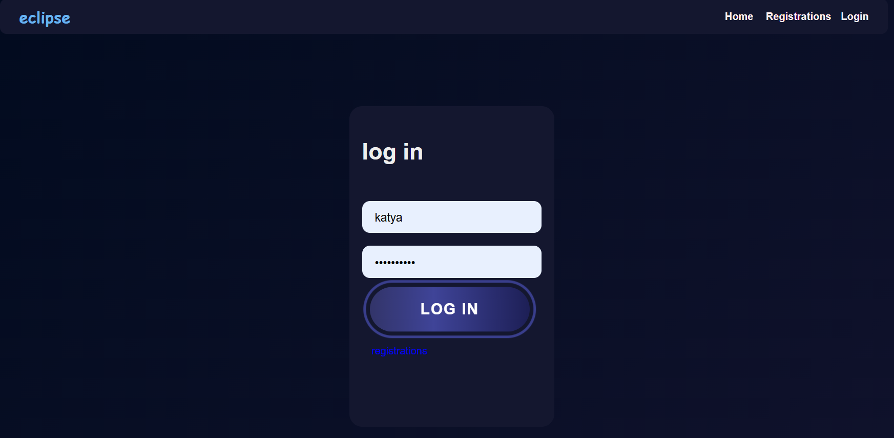

# Django Messenger Backend

Бэкенд-часть мессенджера, разработанная на Django с использованием базы данных MySQL. Была реализована в рамках курсового проекта по дисциплине "Технологии программирования" (5 семестр). Фронтенд-часть доступна по ссылке: https://github.com/Magiyat/Messenger.

## Скриншоты итогового приложения





## Установка и настройка

1. Клонируйте репозиторий

2. Создайте и активируйте виртуальное окружение:
   ```bash
   python -m venv venv
   source venv/bin/activate  # Linux/MacOS
   # или
   venv\Scripts\activate  # Windows
   ```
   
3. Настройте базу данных MySQL:
   - Создайте базу данных
   - Обновите настройки в `settings.py`:
     ```python
     DATABASES = {
         'default': {
             'ENGINE': 'django.db.backends.mysql',
             'NAME': 'messenger_db',
             'USER': 'your_user',
             'PASSWORD': 'your_password',
             'HOST': 'localhost',
             'PORT': '3306',
         }
     }
     ```
4. Запуск сервера:
   ```bash
   python manage.py start_dev
   ```

## API Endpoints

Хранятся по ссылке: https://github.com/til-we-die/course_work/blob/main/course_work/README.md

## Технологии

- Python 3.x
- Django 4.x
- Django REST Framework
- MySQL
- Redis
- React (TypeScript)
